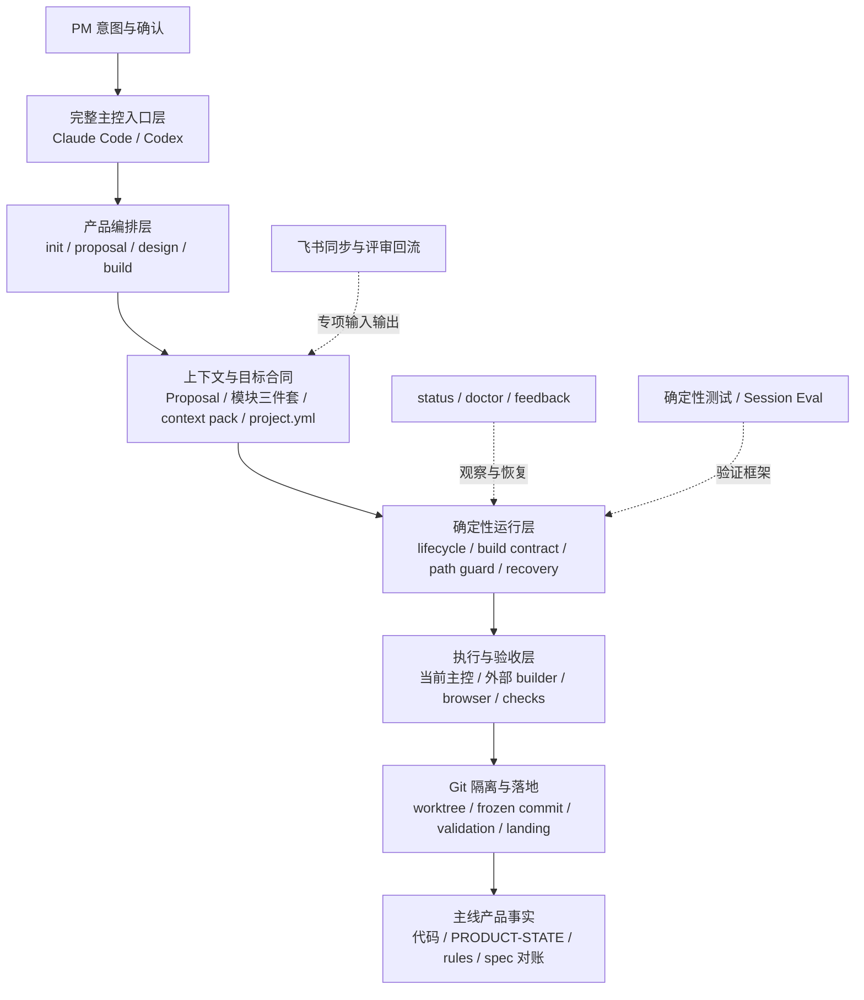

# PMAI 框架所有者视图与复杂度收口分析

> 状态：架构边界已由 PM 确认；复杂度收口批次一至四已经落地。后续只剩批次五，不把未迁移的兼容资产写成已经清理。
>
> 基线日期：2026-08-11。当前提交和完整测试数字只在 [`RUNTIME.md`](../../RUNTIME.md) 维护。本文不包含 Session Eval 的实现设计；评测方法另见 [`agent-harness-evaluation-methodology.md`](./agent-harness-evaluation-methodology.md)。

## 1. 结论先行

PMAI 当前已经形成了一套完整的单人 PM 产品协作 Harness：它不只提供 Prompt 或 Skill，还管理产品目标、模块决定、建造范围、Agent 执行、Git 隔离、验收证据、主线落地和产品事实回写。

当前最强的部分是：

- 产品主链和文档职责已经基本闭合。
- 对陈旧上下文、越界写入、伪造完成、半合并状态和中断恢复有明确的失败关闭机制。
- `prototype / product` 共用一条生命周期，同时按风险生成不同验收。
- 确定性测试覆盖较强，当前完整基线见 `RUNTIME.md`。

当前最需要改善的部分不是继续增加能力，而是降低框架所有者的理解和维护成本：

- 21 个公开 Skill 同时包含主链、专项、运维和恢复意图，但缺少基于 PM 真实使用情况的分层视图。
- lifecycle、旧 stage、顶层状态、build 内状态和多代合同同时存在。
- 主控已收缩为 Claude Code / Codex，但 Kimi / OpenCode 的旧主控资产仍处于诊断和清理兼容窗口。
- 飞书评审、原子写入等专项子系统已经接近独立产品的复杂度，但没有清晰的产品等级和投入边界。
- 兼容逻辑有读取规则，却缺少统一的进入条件、观察指标和退休期限。
- 关键实现和 Skill 文档体积较大，框架行为越来越难由所有者直接审阅。

因此，下一阶段建议不是立即引入多 Agent、开放式动态工作流或新的状态机，而是：

1. 以本文作为框架所有者基线。
2. 由 PM 确认核心、专项、兼容和退出边界。
3. 先明确产品表面的真实使用层级，并归一化内部状态。
4. 再在唯一状态模型上建立统一 Loop Contract。
5. 暂时用固定消费仓场景人工验证；需要比较策略时再建设 Session Eval。

## 2. 本次分析回答什么

本文只回答四个问题：

1. PMAI 现在实际上是什么系统。
2. 它的核心价值和关键保证由哪些组件承担。
3. 当前复杂度主要从哪里产生。
4. 哪些架构边界需要 PM 决策，才能安全进入下一轮收口。

本文已经记录 PM 确认的产品支持范围和风险边界。批次二已实现仓库身份统一和宿主新写入口收缩；仍未直接实施：

- 删除或隐藏具体 Skill；当前没有明确候选。
- 清理真实安装态中的 Kimi / OpenCode 遗留主控入口，以及迁移已有消费仓。
- 退休某个旧合同或消费仓版本的具体日期。
- 删除超出威胁模型的文件安全代码。
- 拆分飞书 adapter 或落地统一 Loop Contract。

这些实现动作必须按第 10 节逐批完成，并分别建立迁移、回归和退出证据。

本轮配套清单：

- [`compatibility-assets-and-consumer-inventory.md`](./compatibility-assets-and-consumer-inventory.md)：逐项记录旧合同的读取者、新写版本、真实消费仓依赖、迁移动作和退休条件。
- [`host-capability-current-and-target-matrix.md`](./host-capability-current-and-target-matrix.md)：记录两个完整主控、三个 Builder、已完成的新写收缩和仍待处理的遗留资产。

## 3. 产品定位与设计约束

### 3.1 一句话定位

PMAI 是面向单人 PM 的产品上下文统一层，也是约束 Agent 如何把已确认产品意图安全落成主线事实的本地 Harness。

它管理的不是单次回答，而是一条跨会话、跨阶段、跨宿主的产品事实链：

```text
产品方向
  → 模块决定
  → 可建造规格
  → 受约束实现
  → 独立验证
  → 主线事实
  → 产品现状回写
```

### 3.2 核心用户与使用环境

| 维度 | 当前约束 |
|---|---|
| 用户 | 单人 PM，而非团队 SOP 平台 |
| 项目 | 多项目、长期演进、产品上下文复杂的消费仓 |
| 运行方式 | 本地 Git 仓库 + Agent 宿主 + 全局安装的 PMAI |
| 主要资产 | Markdown 产品文档、结构化合同、代码、Git 历史和验收产物 |
| 关键风险 | Agent 误解目标、使用陈旧依据、越界修改、自报成功、错误合并和中断后重复动作 |
| 非目标 | 通用设计工作台、团队协作平台、多租户基础设施、首版原型生成器 |

### 3.3 非功能要求

PMAI 的非功能要求不是传统在线服务的吞吐量和可用率，重点是：

| 要求 | 所有者可理解的标准 |
|---|---|
| 可恢复 | 会话、进程或合并中断后，能够从仓库事实继续，且不重复落地 |
| 可追溯 | 能说明本轮目标、依据、修改范围、验证结果和最终主线事实 |
| 安全失败 | 无法判断路径、状态、证据或仓库身份时停止，而不是猜测继续 |
| 不破坏 WIP | 不覆盖 PM 或其它会话已有的未提交工作 |
| 可迁移 | 已有消费仓可以读取旧合同并逐步进入新模型，不要求批量重写 |
| 低 PM 负担 | PM 负责产品决定和验收，不负责组织内部命令、状态和证据 |
| 可维护 | 同一个产品概念应有一个当前模型；兼容差异应留在边界 |

## 4. 框架所有者视图

### 4.1 系统全景



这张图的关键不是文件位置，而是责任方向：上层表达意图，下层逐步增加确定性；执行结果最终只能通过真实 Git 和文档事实回到产品上下文。

### 4.2 PM 的主路径

正常主链只有一条：

```text
init
  → proposal
  → design
  → spec-writing
  → build
  → PM 看结果并多轮修改
  → PM 明确定稿
  → final validation
  → landed
  → documentation
  → complete
```

其中：

- `init` 只搭产品上下文骨架，不提前决定技术栈或创建代码。
- `proposal` 决定产品为什么成立、为谁服务、边界和 MVP 证明目标。
- `design` 决定模块对象、规则、任务路径、权限、状态和关键交互。
- `spec-writing` 把已经闭合的决定编译成规格，通常由 design 自动调用。
- `build` 读取冻结依据，控制实现、迭代、定稿、验收、落地和文档对账。

旁路只处理明确的独立意图：

| 旁路 | 职责 |
|---|---|
| `status` | 恢复产品进度和唯一下一步 |
| `quick-fix` | 在不改变产品模型时处理局部缺陷 |
| `record` | 无 active work 时补录已经确认的长期知识 |
| `build-cancel` | 放弃尚未进入主线的隔离候选 |
| `doctor / upgrade` | 检查和维护框架安装、宿主入口与消费仓兼容性 |
| `feedback` | 从真实会话形成框架改进证据 |
| Lark / 文档 / mockup | 按需扩展，不应分叉产品生命周期 |

### 4.3 四个核心循环

PMAI 当前不是一个循环，而是四个相互约束的循环：

| 循环 | 输入 | 成功条件 | 失败时返回 |
|---|---|---|---|
| 产品方向循环 | 背景、已有资料、PM 判断 | Proposal 与产品基线原子一致 | 继续澄清或保留旧版本 |
| 模块设计循环 | Proposal、产品现状、模块上下文 | 决定闭合、规格完成、建造依据冻结 | 继续 design；方向变化回 Proposal |
| 构建迭代循环 | 冻结依据、批准路径、项目定义 | PM 看见可运行结果并明确请求定稿 | 修复、继续迭代或回 design |
| 落地恢复循环 | 冻结 commit、最终证据、主线状态 | 实现进入 main 且文档完成 | 保留 `final_check` 或 `landed/docs_pending` 恢复点 |

这四个循环已经存在，但循环合同分散在 Skill、脚本、共享文档和状态字段里。后续 Loop Engineering 的重点应是统一表达这些循环，而不是创造第五套状态。

### 4.4 PM、Agent、Harness 与工具的权责

| 角色 | 应负责 | 不应负责 |
|---|---|---|
| PM | 产品目标、关键取舍、风险接受、看结果、定稿 | 记忆内部命令、维护状态字段、手工组织验收链 |
| Agent | 理解上下文、提出判断、执行授权动作、解释结果 | 自行改变产品目标、扩大批准范围、仅凭自报宣布成功 |
| Harness | 路由、状态约束、路径边界、证据验证、恢复和生命周期提交 | 替 PM 做产品取舍、把模型主观判断伪装成机器事实 |
| 工具与宿主 | 执行命令、修改文件、提供浏览器或模型能力 | 成为产品真相源或绕过 PMAI 合同直接决定完成 |

所有者需要重点防止一种责任合并：执行 Agent 同时成为唯一证据提供者、最终裁判和生命周期提交者。当前 P1 修复已经在发布门上失败关闭，但真实 Session 的独立观测仍属于后续能力。

### 4.5 消费仓真相源

| 事实 | 当前真相源 | 约束关系 |
|---|---|---|
| 产品方向 | 当前 Proposal 正文 | 与 `PRODUCT.md` 精简基线和 `.pm-workflow/proposal.json` hash 绑定 |
| 产品长期基线 | `PRODUCT.md` | 下游只读；方向变化回 Proposal |
| 已落地现状 | `PRODUCT-STATE.md` + main 代码 | 只在 landed 后更新 |
| 跨模块规则 | `PRODUCT-RULES.md` | 只保存当前有效的跨模块行为规则 |
| 模块知识 | `discussion.md / decisions.md / spec.md` | 分别承担探索、决定依据和最终目标合同 |
| 建造定义 | `.pm-workflow/project.yml` | 唯一定义类型、技术栈、入口和真实命令 |
| 当前工作状态 | 模块 `.work-meta.json` | 保存 active 状态和 build contract，不承载长期产品知识 |
| 本轮上下文完整性 | context pack + source hash | 防止 Proposal、规格或项目定义变化后继续使用旧批准 |
| 实现事实 | Git commit、diff、worktree 和 main 祖先关系 | Agent 回复不能替代 Git 事实 |
| 验收事实 | build evidence 与 audit artifacts | 必须绑定 source hash 和 implementation commit |

### 4.6 生成器仓真相源

| 事实 | 真相源 |
|---|---|
| 产品定位与取舍 | [`PRODUCT.md`](../../PRODUCT.md) |
| 当前状态、基线和下一步 | [`RUNTIME.md`](../../RUNTIME.md) |
| 当前机器与流程约束 | [`INVARIANTS.md`](../../INVARIANTS.md) |
| 用户安装和使用方式 | [`README.md`](../../README.md) |
| 开放工作 | [`TODOS.md`](../../TODOS.md) |
| 实际框架行为 | `skills/`、`scripts/`、`hooks/`、`templates/`、`bin/` |
| 可验证基线 | `tests/` 和 `evals/` |

本次盘点曾发现一处可见漂移：`RUNTIME.md` 把已经进入当前 `HEAD` 的 P1 修复写成“尚未提交”。批次一已修正文案，但这仍说明真相源规则已经建立、维护成本尚未收口；后续应让机器可派生的 Git 和测试事实由检查生成或校验。

### 4.7 当前 Harness 的关键保证

| 保证 | 当前机制 |
|---|---|
| 不从错误目标开工 | Proposal gate、ready contract、project definition |
| 不使用陈旧设计 | context pack、source hash、final currentness |
| 不越过批准范围 | target paths、main 写入白名单、active build hook、commit scope 校验 |
| 不污染主线 WIP | build worktree、dirty check、未跟踪路径碰撞检查 |
| 不用旧证据定稿 | implementation commit / source hash 绑定和 evidence invalidation |
| 不让验证改写候选 | detached validation worktree |
| 不在失败后重复合并 | lifecycle、landing ancestor 验证、audit cursor、`docs_pending` 恢复 |
| 不误删隔离环境 | pending cleanup、Git worktree 核验、OID CAS、幂等清理 |
| 不让测试假绿 | suite timeout、摘要与退出码交叉验证、零用例失败关闭 |
| 不让稳定发布依赖自报 | 真实 runner、独立 judge 和 evaluation 绑定发布门 |

这些保证构成 PMAI 的核心价值，不应在复杂度收口中为了减少代码量而直接削弱。

## 5. 当前复杂度画像

以下数字只用于表示所有者需要面对的规模，不直接代表代码质量：

| 项目 | 当前规模 |
|---|---:|
| 公开 Skill | 21 个 |
| 全部 Skill / shared Markdown | 约 10,884 行 |
| 脚本、Hook 和 CLI 主要运行时代码 | 约 48,199 行 |
| `tests/run-all.sh` 编排的测试脚本 | 90 个 |
| 当前完整确定性基线 | 952 passed / 0 failed |
| 飞书 review / sync-from-lark / publish 相关主要实现与 Skill | 约 11,497 行 |
| 原子写入与宿主配置事务相关主要实现 | 约 4,876 行 |

规模本身不是问题。问题是：这些成本是否与核心用户价值、支持范围和实际风险相匹配，所有者能否清楚知道哪些变化会影响主链。

## 6. 组件分类

### 6.1 核心：应长期保护

| 组件 | 为什么是核心 | 收口原则 |
|---|---|---|
| Proposal / PRODUCT 基线 | 防止模块工作脱离产品方向 | 保留版本化与原子绑定，简化重复表达 |
| Design / 模块三件套 | 承载模块探索、决定和可建造规格 | 保持职责分离，不再增加新的模块文档真相源 |
| `project.yml` | 把产品设计与真实代码入口连接起来 | 保持唯一，旧来源只在读取边界兼容 |
| context pack / source hash | 防止陈旧依据进入 build | 保持确定性，统一 hash 版本升级策略 |
| lifecycle / build contract | 控制 build、定稿、落地和恢复 | 归一化为一个当前模型，旧合同不进入主逻辑 |
| worktree / 路径白名单 / WIP 保护 | 限制 Agent 修改和合并范围 | 保留失败关闭和恢复能力 |
| final validation / landing / documentation | 让实现、证据和主线事实闭环 | 保持幂等和可恢复 |
| status | 降低 PM 恢复上下文的成本 | 只读投影权威状态，不形成第二套状态 |
| tests / invariants | 证明确定性 Harness 的硬保证 | 按不变式维护，不追求无意义用例数量 |

### 6.2 支撑能力：保留，但不应主导架构

| 组件 | 价值 | 边界 |
|---|---|---|
| doctor / upgrade | 维护安装态、宿主入口和消费仓兼容性 | 与产品主链分离，修复继续需要 PM 确认 |
| quick-fix / cancel / record | 承接真实旁路意图 | 不得分叉完整 lifecycle 或修改产品目标 |
| acceptance profile / browser adapter | 按项目风险生成验收 | 只生产证据，不成为独立真相源 |
| builder adapters | 允许选择当前主控或外部执行器 | 统一输入输出合同，避免主链理解各宿主细节 |
| feedback | 把真实使用问题送回框架仓 | 保持只读和证据绑定，不自动修改框架 |

### 6.3 专项能力：需要明确产品等级

| 组件 | 当前价值 | 当前成本或风险 |
|---|---|---|
| meta / mockup | 提升 design 的产品判断和交互探索 | 同时支持自动编排和手动专项调用，实际使用频率尚未记录 |
| spec-writing / doc-writing / humanize | 把决定编译为不同文档 | 入口边界容易让 PM 判断该选哪个 |
| mirror-site | 支持参考站对齐 | 依赖浏览器能力，场景明确但不是所有项目都需要 |
| Lark publish / sync-from-lark / review | 把正式文档发布、机械回拉和评审判断接回产品链 | 子系统规模很大、远端失败面复杂、兼容版本较多 |
| personal memory | 跨项目复用个人经验 | 必须保持非权威，不能污染项目事实和 hash |

专项不等于应该删除。需要决定它是“一等产品能力”“可选扩展”还是“维护模式能力”，从而决定默认入口、发布门和投入水平。

### 6.4 兼容能力：应该有退出条件

| 兼容项 | 当前理由 | 收口方向 |
|---|---|---|
| 旧 `stage` | 读取 v1 消费仓和展示旧状态 | 当前模型只用 lifecycle；统计已知消费仓后设退出条件 |
| 顶层与 `build.lifecycle_state` | 支持不同代状态位置 | 在读取边界归一化，主逻辑只接收 canonical state |
| build contract v1-v4 | 恢复历史 active build | 只读或恢复，不允许新写；按已知 active 合同清零后退休 |
| `required_checks` | 旧合同兼容别名 | 只在 normalization 边界映射为 `final_checks`，新写不再生成 |
| `/pmai-build-close` / `close-work.sh` | 旧调用习惯与中断恢复 | 恢复能力保留，公开入口是否保留需单独决定 |
| `project-type.py` | 读取旧 config 和 marker | 新写只走 `project.yml`，完成消费仓升级后退休 |
| 旧迁移脚本 | 帮助历史目录或文档结构升级 | 建立支持版本表，超过窗口转为只读诊断或归档 |
| `pmai status` CLI 别名、Codex hook wrapper | 兼容旧入口 | 记录真实调用后决定移除版本 |

当前 [`TODOS.md`](../../TODOS.md) 只有 dogfood 验证，没有兼容清单、消费仓使用情况或退休时间。因此兼容代码会自然累积，而不会自动退出。

## 7. 主要复杂度问题

### 7.1 产品表面缺少使用层级

事实：21 个公开 Skill 继续全部注册到 Claude Code 和 Codex；Kimi、OpenCode 不再获得主控 Skill/commands。仓内产品合同同时规定，只有承接独立用户意图的 Skill 才注册为主控入口，`meta / mockup / spec-writing` 虽通常由 design 调用，但明确保留专项手动入口。

影响：

- 没有使用表时，无法区分“公开但低频”和“真正没有独立价值”。
- PM 仍需要理解 `design / meta / mockup / spec-writing / doc-writing` 的边界，但这不等于应该取消手动控制。
- 正常主链不需要的 `build-close` 等恢复能力与前台能力处于同一可见等级。
- 每增加一个完整主控宿主，都要同步维护所有公开入口，因此新增主控必须单独做产品级决策。

根因不是 Skill 太多，而是缺少“产品职责层级”和“真实使用频率”两个维度。没有使用证据前，不应根据主路径或入口数量隐藏 Skill。

### 7.2 同一状态跨代并存

批次三前的事实：权威虽是 lifecycle，但代码仍分散读取或写入旧 `stage`；lifecycle 同时出现在 `.work-meta.json` 顶层和 `build` 内；`required_checks` 与 `final_checks` 同时保留；build contract v1-v4 参与不同恢复路径。当前已由唯一 normalization 边界统一读取，新写收敛为 v5，历史形态只保留恢复兼容。

影响：

- 新功能必须理解多代字段和迁移条件。
- 状态投影、doctor、status、build 和恢复脚本可能产生不同解释。
- 后续统一 Loop Contract 容易变成另一套并行状态。

最直接的解法不是立刻重写消费仓，而是在框架读取边界输出唯一 canonical model；主逻辑不再感知旧版本，写入只产生当前版本。

### 7.3 宿主与执行器矩阵过宽

事实：Claude Code、Codex 是完整主控并使用项目 Hook；Kimi、OpenCode、Cursor Agent 只作为外部 Builder。新 install、upgrade、init 已停止 Kimi/OpenCode 主控入口，Doctor 仅报告旧资产；Builder prompt 固定声明不得推进 lifecycle、验收或 landing。

影响：

- Claude Code/Codex 的完整主控承诺仍需要各自的 Hook 和入口回归。
- Builder 仍需维护 CLI 参数、prompt、退出码和 changed-path 合同，但不再复制 lifecycle 与恢复能力。
- `/pmai-feedback` 目前只有 Codex 的精确会话链路已验证；这属于专项能力差异，不扩张 Builder 权限。

PM 已确认并已落地新写等级：Codex、Claude Code 作为完整主控，Kimi、OpenCode 只作为 Builder。真实安装态和消费仓的遗留入口仍按兼容计划逐仓清理，不直接删除未知依赖。

### 7.4 专项子系统与核心发布耦合

飞书相关主要实现和 Skill 已超过 12,000 行，并维护远端 revision、原生结构、评论动作、handoff、checkpoint、回读验证和多个 schema 版本。

这些设计对文档评审安全有直接价值，但其故障面、测试成本和兼容成本已经与主链不同。PM 已确认飞书是官方维护的可选能力：三个公开意图继续保留，但内部 schema、环境和发布验证需要与核心完整性隔离。

### 7.5 文件安全实现超过常规单人工具复杂度

原子写入和宿主配置事务相关主要实现约 4,876 行，覆盖 symlink、目录 fd、inode、设备、CAS、并发替换、回滚和 Bash 3.2。

这些机制保护真实用户文件，不能因为代码多就删除。但当前需要明确威胁模型：

- 必须防：误覆盖、symlink 重定向、正式 writer 并发、半写入和失败回滚。
- 当前明确不完全防：同一 OS 用户下不遵守共享锁的恶意或非合作进程。
- 已确认：边界固定在正常单人协作、合作 writer 并发和失败恢复；不再为同用户恶意进程或不合作 writer 的更窄竞态默认增加实现。

没有威胁模型，安全代码会不断增加，却无法判断何时已经足够。

### 7.6 大文件与长 Skill 增加审阅成本

当前较大的实现包括：

- `lark-review.py`：约 8,448 行。
- `atomic_file.py`：约 3,374 行。
- `build-contract.py`：约 2,561 行。
- `consumer-doctor.py`：约 1,286 行。
- `status-view.py`：约 1,227 行。

主要前台 Skill 也较长：build 约 529 行、design 约 423 行、spec-writing 约 335 行。

风险不是文件长度本身，而是一个改动需要同时理解状态解析、兼容、业务规则、CLI 和写入副作用。拆分应按稳定职责边界进行，例如 `schema / normalization / transition / evidence / CLI`，而不是仅按行数机械切文件。

### 7.7 生成器仓与消费仓身份已统一输出

批次二新增 `repo-kind.py` 与 `_lib/repo_identity.py`，唯一输出 `generator / consumer / uninitialized`。`skill-preamble.sh`、`status-view.py`、Doctor 和 Kimi 遗留 dispatcher 复用同一解析器；`PMAI_PROJECT_INITIALIZED` 只保留为兼容投影。

这解决了上层把“已初始化”误解为“这是消费仓”的根因，并通过严格生成器 marker、路径边界和普通 `docs/` 反例避免误判。

剩余兼容工作是让后续新增入口只读三态，不再新增本地 marker 判断；解析器不可用时，PMAI 路由必须失败关闭。

### 7.8 当前状态文档仍可能漂移

`RUNTIME.md` 已经是状态真相源，但当前仍出现“修复尚未提交”与 Git `HEAD` 不一致。原因不是缺少规则，而是状态字段需要人工重复维护。

收口方向应是：机器能够派生的 commit、分支和测试摘要尽量由检查生成或校验；`RUNTIME.md` 只保留机器无法推导的目标、解释和下一步。

## 8. 当前成熟度判断

| 维度 | 判断 | 依据 |
|---|---|---|
| 产品模型 | 强 | 定位、主链、文档职责和非目标清楚 |
| 确定性安全 | 强 | 路径、WIP、currentness、证据、landing 和测试均有失败关闭 |
| 恢复能力 | 强 | build、merge、文档和清理有明确恢复状态 |
| PM 主路径 | 基本清楚 | README 主链简单，但实际公开入口较多 |
| 所有者可理解性 | 有风险 | 多代状态、长 Skill、大型专项子系统和宿主差异并存 |
| 兼容治理 | 已建立基线 | 已有兼容清单、真实消费仓快照和退休条件；尚未执行逐仓迁移 |
| 扩展治理 | 改善中 | 宿主等级和飞书产品等级已制度化；内部状态与 Loop Contract 仍待收口 |
| Agent 真实效果证明 | 尚不完整 | 确定性测试强，真实 Session 的独立观测和稳定性评测尚未建立 |

综合判断：PMAI 已经是合格的确定性工作流 Harness，但正在接近“功能和安全机制增长速度超过所有者认知压缩速度”的临界点。下一阶段应以收口为主，而不是继续横向增加能力。

## 9. 已确认的架构边界

以下按 ADR 形式记录。ADR-001 保持阶段性决定；ADR-002 至 ADR-006 已由 PM 在 2026-08-11 确认。ADR-002 的新写入口收缩已经完成，但真实安装态和消费仓遗留资产尚未迁移；其它 ADR 仍按各自状态推进。

### ADR-001：默认 Skill 表面

- **状态**：阶段性决定。Codex、Claude Code 作为完整主控时，21 个现有 Skill 继续保持可手动调用。
- **问题**：21 个 Skill 是否继续全部作为同等级宿主入口。
- **建议方向**：先按主链、双入口、独立专项、框架运维和恢复能力表达职责；“会自动调用”不取消手动入口。只有确认没有实际手动需求、没有独立用户意图、前台路由可靠且恢复不受损时，才讨论隐藏。
- **保留方案**：继续全部公开，依靠文档解释主路径。
- **取舍**：保持可调用能保留 PM 控制力；宿主矩阵成本改由 ADR-002 的支持分级收口，不再要求四个宿主同步全部入口。
- **证据策略**：当前没有明确隐藏或删除候选，因此不扫描历史私人会话做无目的使用统计。未来只有出现具体候选时，才收集与该候选直接相关的手动使用和恢复证据。

### ADR-002：宿主支持等级

- **状态**：已确认；新安装、新升级和新消费仓已落地，遗留清理未执行。
- **问题**：四个主控宿主是否都承诺相同能力。
- **决定**：Codex、Claude Code 是完整主控；Kimi Code、OpenCode 降为仅 Builder。
- **实施含义**：完整 Skill、项目入口、Hook、恢复能力与主控回归只对 Codex、Claude Code 承诺。Kimi、OpenCode 只保留外部构建执行适配器；现有 Kimi Skill / Hook 和 OpenCode commands 进入兼容清理清单，后续新增 Skill 不再为二者建设主控入口。
- **保留方案**：继续逐个补齐所有宿主能力。
- **取舍**：全对等扩大覆盖，但每项核心能力都承担矩阵成本；分级会降低部分宿主承诺。

### ADR-003：兼容支持窗口

- **状态**：已确认。
- **问题**：stage、旧 build contract、旧检查字段和迁移脚本何时退出。
- **决定**：保证旧消费仓可恢复、可升级，但不无限维护所有历史版本。先建立“可读版本、可恢复版本、新写版本、退休条件”清单；有旧 active work 的消费仓继续恢复，无 active work 的消费仓执行一次受控升级。所有已知消费仓不再依赖某旧合同时，按明确节点退休对应读取、迁移与测试。
- **保留方案**：无限期读取所有历史版本。
- **取舍**：无限兼容降低升级压力，但每个新能力都要理解历史状态。

### ADR-004：文件安全威胁模型

- **状态**：已确认。
- **问题**：原子写入继续防到什么程度。
- **决定**：保护 PM 未提交改动、路径穿越与危险 symlink、遵守 PMAI 合同的并发 writer、关键操作中断恢复，以及 worktree / branch 删除前的身份与内容核验。不承诺抵抗同一用户权限下的恶意进程、不合作程序持续抢写、恶意文件系统或被替换的 Git 可执行程序。
- **实施含义**：以后发现竞态时先判断是否落在上述承诺内；不再以“更安全”为由无边界增加本地事务复杂度，并据此审查现有实现是否存在超出威胁模型的保护。
- **保留方案**：继续对发现的每一种本地竞态追加保护。
- **取舍**：更强保护降低极端风险，但会持续增加跨平台维护成本。

### ADR-005：飞书能力的产品等级

- **状态**：已确认。
- **已确认的公开边界**：本地到飞书统一使用 `publish-to-lark`，首次创建、默认精细更新和明确整篇覆盖是其内部策略；明确以飞书为准且不需要判断时使用 `sync-from-lark`；需要理解正文或批注影响时使用 `lark-review`。旧四模式 `lark-sync` 退出公开模型，publish 与 review 只共用内部写回合同，不互相调用公开 Skill。
- **问题**：飞书评审回流是核心主链的一等能力，还是可选扩展。
- **决定**：飞书是 PMAI 官方维护的可选能力，不是核心完整性的前提。完全不用飞书的用户仍然使用一套完整 PMAI；需要飞书时继续使用三个公开 Skill。
- **实施含义**：核心主链只接收通用评审结果，不理解飞书 revision、comment、原生 block 和精细写回 schema。飞书内部能力通过明确 adapter 与核心合同交互；缺少飞书账号、CLI 或环境不阻断 PMAI 核心版本发布。
- **保留方案**：继续与主仓同版本、同发布节奏演进。
- **取舍**：一等能力能提供完整评审闭环；扩展化可以隔离远端兼容成本。

### ADR-006：Loop Contract 的位置

- **状态**：已确认。
- **问题**：如何推进 Loop Engineering 而不增加新状态机。
- **决定**：下一阶段优先统一内部 Loop Contract，不新增大型用户能力。先将旧状态归一化，再把 `观察 → 目标 → 允许动作 → 执行 → 验证 → 提交 / 恢复 / 停止` 定义为运行协议；lifecycle 继续是唯一持久状态。
- **实施顺序**：先为 Build 定义输入、允许动作、验证、重试、升级和停止条件；稳定后再映射 Proposal 与 Design。先用固定消费仓场景人工验证“走对、停对、恢复对”，需要比较 Prompt、动态路由或多 Agent 策略时再进入 Session Eval。
- **保留方案**：继续让每个 Skill 独立描述自己的循环。
- **取舍**：统一协议降低重复和行为漂移，但需要对主链 Skill 和脚本职责重新分层。

## 10. 建议的收口顺序

执行时一次只推进一个批次。每批先完成清单与验收标准，再改实现；前一批没有形成可验证结果前，不并行启动后续大型重构。批次一至四已经完成，下一步从批次五开始。

### 批次一：只降低认知成本，不改变用户行为（已完成）

1. 保持 `RUNTIME.md` 与 Git、测试基线一致。
2. 建立兼容资产与已知消费仓清单，记录每个仓的 active work、合同版本和可升级条件。
3. 建立当前宿主能力矩阵，并单独写出目标矩阵：Codex、Claude Code 为完整主控，Kimi、OpenCode 仅 Builder。
4. 以本文作为后续架构决定与验收边界的入口。

### 批次二：明确产品表面（已完成新写收缩）

1. 增加统一 `repo_kind = generator / consumer / uninitialized`。
2. 保持 Codex、Claude Code 的现有 Skill 手动入口；不做无目的历史使用统计。
3. 停止为 Kimi、OpenCode 新增或刷新主控入口；现有入口已进入兼容清单，只诊断、不自动删除。
4. 让 status 和自然语言路由继续承接恢复与专项意图；只有出现明确隐藏候选时才补定向使用证据。

### 批次三：归一化内部模型（已完成）

1. `_lib/work_contract.py` 成为旧合同到 canonical model 的单一读取边界，统一输出 lifecycle、display stage、contract version、iteration checks、final checks 和兼容来源。
2. status、state/preamble、Doctor、ready、replan、context pack、Lark active-build 路由、finalize、landing、cleanup 和主分支写入门禁不再自行回退旧字段。
3. 新 build contract 升为 v5：build 前只写顶层 lifecycle；build 开始后只写 `build.lifecycle_state`，不再写 `stage`、顶层 lifecycle 或 `required_checks`。acceptance profile v3 同样停止输出别名。
4. 旧 v1-v4 继续由兼容边界读取；冲突 lifecycle、别名不一致、非法版本和非法类型失败关闭。真实消费仓未迁移，兼容删除仍须满足 ADR-003 退出门并由 PM 单独确认。

### 批次四：降低维护热点

**状态：已完成（2026-08-12）**

1. 按职责拆分 `build-contract.py`，由 `_lib/build_schema.py`、`build_transition.py`、`build_evidence.py`、`review_evidence.py` 分别承接合同结构、状态迁移、验收证据和可选评审适配；主 CLI 保留命令入口与组合逻辑。
2. 将 Lark 子系统作为官方可选能力，通过 `review_evidence.py` adapter 与核心合同隔离；核心 Build CLI 不 import Lark adapter，稳定核心发布门不要求飞书 CLI 或账号。
3. 按 ADR-004 审查原子写入，保留路径安全、合作 writer、失败恢复和 worktree/branch 身份保护；在 `atomic_file.py` 明确不承诺同用户恶意进程、非合作 writer、恶意文件系统或被替换 Git。
4. 新增 `finalize-candidate.py` 统一读取当前 Git HEAD、记录实现提交并启动 `finalize-work.py`；Skill 只保留 PM 定稿意图、决策门、入口和失败路由。
5. 新增维护边界与收尾编排回归；默认全量保留 Lark fake regression，稳定核心 release gate 可显式跳过可选 Lark suites。

### 批次五：统一 Loop Engineering

**状态：待开始，也是所有者视图中剩余的唯一批次。**

1. 先对 Build Loop 定义统一输入、允许动作、验证、重试、升级和停止条件。
2. 再将 Proposal 和 Design 映射到同一 Loop Contract。
3. 用固定消费仓场景人工验证“走对、停对、恢复对”。
4. 需要比较 Prompt、动态路由或多 Agent 时，再进入 Session Eval。

## 11. 现在不建议做什么

在本轮收口完成前，不建议进入默认主链的能力包括：

- 多 Agent 规划、执行与审查拓扑。
- Agent 自主修改或持续重写产品目标。
- Agent 运行时发明核心阶段的开放式动态工作流。
- 新的持久化 loop state、task state 或 decision state。
- 以“更安全”为理由继续扩展没有威胁边界的本地事务机制。
- 只按文件长度进行的大规模拆分。

这些技术可以保留为研究项，但在当前阶段加入，只会扩大尚未收口的状态、入口和宿主矩阵。

## 12. PM 已确认的答案

1. **Skill 表面**：Codex、Claude Code 暂时保留现有手动入口；没有明确隐藏候选前不做无目的使用统计。`feedback`、`build-close`、`status`、`humanize` 已确认维持现状。
2. **宿主等级**：Codex、Claude Code 是完整主控；Kimi Code、OpenCode 仅作为 Builder。
3. **兼容窗口**：接受对已知消费仓执行受控升级，并在没有旧 active work 依赖后按节点退休旧合同。
4. **飞书等级**：官方维护的可选能力；不用飞书的 PMAI 仍然完整。
5. **下一阶段**：先收口内部合同和 Build Loop，不新增大型用户能力；暂不提前建设 Session Eval。
6. **安全边界**：按单人本地工具保护正常操作、合作并发和失败恢复，不防御同用户恶意进程与不合作 writer。

这些答案已经足够形成实施计划。后续不再为机械清理、目录归一或文档漂移反复请求 PM 拍板；只有改变产品表面、支持承诺、数据风险或核心流程时再请求确认。

## 13. Skill 使用分类表

### 13.1 分类原则

本表分开记录三件事：

1. **框架职责**：Skill 在产品架构中的位置。
2. **调用方式**：框架设计上允许手动调用、自动调用，还是两者都允许。
3. **个人使用事实**：PM 是否真实手动使用，以及使用频率和原因。

前两项可以从仓内合同判断，第三项只能由 PM 确认或在 PM 授权后从使用记录统计。本轮只确认了“部分 Skill 会被手动调用”，尚未确认具体名单，因此不能把未知填写成“从不使用”。

频率统一使用：`经常 / 偶尔 / 极少 / 从不 / 误触 / 待确认`。

### 13.2 当前 21 个公开 Skill

| Skill | 框架职责 | 设计调用方式 | 独立手动意图 | 个人使用事实 | 当前处理 |
|---|---|---|---|---|---|
| `init-project` | 一次性项目入口 | 手动 | 初始化或接入项目 | 待确认 | 保留公开 |
| `proposal` | 产品方向主链 | 手动；下游发现方向变化时返回 | 澄清或重判产品方向 | 待确认 | 保留公开 |
| `design` | 模块设计主链 | 手动；承接上游返回 | 设计或重做功能模块 | 待确认 | 保留公开 |
| `spec-writing` | 规格编译 | design 自动 + 手动 | 将已确认决定整理为规格或 PRD | 待确认 | 保留双入口 |
| `build` | 构建、迭代与自动收尾主链 | 手动 + 自然语言续接 | 开工、继续修改、定稿 | 待确认 | 保留公开 |
| `status` | 产品进度恢复 | 手动 + session 启动投影 | 新窗口恢复现状和下一步 | 待确认 | 保留双入口 |
| `quick-fix` | 轻量修改旁路 | 手动 | 修复不改变产品模型的小问题 | 待确认 | 保留公开 |
| `record` | 已确认知识补录 | 手动 | 无 active work 时补录待办、术语、规则或理路 | 本会话曾误触，不计有效使用 | 保留公开，待确认真实使用 |
| `build-cancel` | 构建取消 | 手动 | 放弃尚未进入主线的候选 | 待确认 | 保留安全入口 |
| `build-close` | finalize 兼容与恢复 | build 自动 + 手动恢复 | 中断、冲突或 `docs_pending` 后续跑 | 待确认 | 保留恢复入口 |
| `meta` | 产品模型深度判断 | design 自动 + 手动 | 主动要求第一性原理、反例或重判 | 待确认 | 保留双入口 |
| `mockup` | 交互方向探索 | design 自动 + 手动 | 主动查看交互方向或可视化探索 | 待确认 | 保留双入口 |
| `doc-writing` | 介绍型文档成文 | 手动 | 产品介绍、一页纸、汇报或对外材料 | 待确认 | 保留专项入口 |
| `humanize` | 文字表达收口 | doc/spec 自动 + 手动 | 单独润色、去 AI 腔 | 待确认 | 保留双入口 |
| `mirror-site` | 参考站对齐 | 手动 | 按真实站点校准或重建 Web 结果 | 待确认 | 保留专项入口 |
| `lark-review` | 飞书评审回流 | 手动 + 未完成批次恢复 | 回收正文修改、评论和回复 | 待确认 | 保留专项入口 |
| `sync-from-lark` | 飞书到本地机械回拉 | 手动 | PM 已明确以飞书为准且不需要产品判断 | 待确认 | 保留方向明确的专项入口 |
| `publish-to-lark` | 本地到飞书发布 | 手动；可被文档流程使用 | 首次创建、默认精细更新或明确整篇覆盖 | 待确认 | 保留方向明确的专项入口 |
| `doctor` | 框架与消费仓诊断 | 手动 | 检查安装、宿主和项目健康 | 待确认 | 保留运维入口 |
| `pmai-upgrade` | 框架升级 | 手动 | 升级、降级或固定版本 | 待确认 | 保留运维入口 |
| `feedback` | 当前会话复盘 | 手动 | 形成可回到框架仓的问题证据 | 待确认 | 保留运维入口 |

### 13.3 本轮得到的结论

- 当前没有任何一个 Skill 仅凭架构定义就能判定为多余。
- `meta / mockup / spec-writing / humanize / status / build-close` 是明确的自动与手动双入口，不应因为可自动调用就取消手动能力。
- 恢复入口即使低频，也可能因失败后果较高而值得保留，不能只按调用次数决定。
- 21 个入口带来的主要成本目前是跨宿主注册、文档边界和所有者认知，而不是已经证明的用户界面冗余。
- 当前不补全量“个人使用事实”统计；只有出现具体隐藏或删除候选时，才定向收集该候选的真实使用证据。
