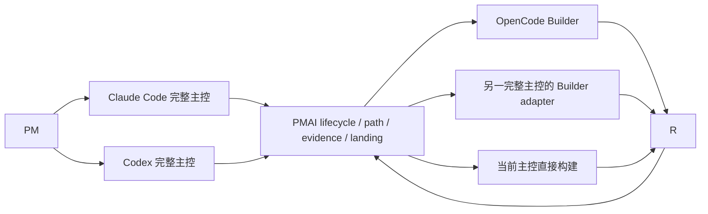

# PMAI 宿主能力当前态与目标态

> 状态：Living document
> 最近核对：2026-08-11
> 已确认目标：Codex、Claude Code 为完整主控；OpenCode 仅作为 Builder；Kimi Code 与 Cursor Agent 不再进入新 build 选项
> 落地状态：新 build 已默认使用当前会话直接构建 + 独立环境；Kimi/Cursor adapter 与旧合同仅作兼容读取

## 1. 为什么要单独维护宿主矩阵

“支持某个宿主”至少可能表示四件不同的事：

1. 能看到并调用 PMAI Skill。
2. 能遵守写保护、自然语言续接和 review guard。
3. 能恢复 lifecycle、提交证据并完成 landing。
4. 只能接收冻结任务，在隔离目录里产出代码改动。

前三项合起来才是完整主控，第四项只是 Builder。旧实现曾把四个宿主都当作主控建设，导致安装、Hook、入口、恢复和测试矩阵持续扩张。批次二已经收缩新安装、新升级和新消费仓；本文件继续把“当前新写什么”和“哪些遗留资产尚未清理”分开。

## 2. 能力等级定义

### 2.1 完整主控

完整主控需要同时满足：

- 能加载完整 PMAI Skill 和消费仓真相源。
- 能执行 Proposal、Design、Build 等生命周期动作。
- 有宿主适配的写保护、active build 续接和 review guard。
- 能运行 Doctor、恢复中断状态、验证证据并推动 landing。
- 宿主差异有明确回归，失败时不能假装护栏已生效。

精确定位当前会话是 `/pmai-feedback` 的专项能力，不是完整主控成立的必需条件；但没有精确标识时该 Skill 必须阻断，不能猜“最近会话”。

### 2.2 Builder

Builder 只负责：

- 接收主控已经冻结的 prompt、目标路径、设计系统和实现深度合同。
- 在 `BUILD_DIR` 或 build worktree 内修改候选实现。
- 返回真实退出码，并保留半成品供主控检查。

Builder 不负责：

- 选择产品方向或修改 Proposal / spec。
- 推进 lifecycle、写验收通过、决定 landing。
- 安装项目主控入口或宣称宿主 Hook 已生效。
- 绕过主控的 changed-path review、证据验证和 Git 落地门。

## 3. 当前实现矩阵

这是当前代码事实，不是最终承诺。

| 能力 | Claude Code | Codex | Kimi Code | OpenCode |
|---|---|---|---|---|
| 完整 Skill 暴露 | 全局 `~/.claude/skills/pmai-*` | 全局 `~/.codex/skills/pmai-*` | 不再安装；旧 symlink 只诊断 | 不再生成；旧 commands 只诊断 |
| 消费仓主控入口 | `AGENTS.md` + `CLAUDE.md` | `AGENTS.md` + `CLAUDE.md` | 不支持；新模板只声明 Builder 边界 | 不支持；新仓无 `.opencode/commands` / `opencode.json` |
| 宿主配置 | 项目 `.claude/settings.json` | 项目 `.codex/hooks.json` | 不再维护；旧 managed hooks 只诊断 | 不生成 PMAI 主控配置 |
| 写保护与路径护栏 | 项目 Hook | 项目 Hook | 不作为主控承诺；遗留 dispatcher 只保留安全兼容 | 由完整主控在 Builder 返回后执行 changed-path review |
| active build 自然语言续接 | prompt Hook 注入 execution context | prompt Hook 注入 execution context | 不支持 | 不支持 |
| review 完整性 guard | 项目 Hook | 项目 Hook | 不支持 | 不支持 |
| lifecycle 与恢复 | 完整支持 | 完整支持 | 不支持 | 不支持 |
| 精确当前会话反馈 | 未验证，缺精确 locator 时阻断 | 已通过 `CODEX_THREAD_ID` 验证 | 未验证，缺精确 locator 时阻断 | 未验证，缺精确 locator 时阻断 |
| 外部 Builder adapter | `claude -p` | `codex exec` | 旧合同兼容 `kimi --prompt` | `opencode run` |
| 当前主要回归 | project hooks、active guard、Skill / build tests | project hooks、active guard、Codex entry、session locator | Builder adapter + 遗留资产不改写 + dispatcher 安全兼容 | Builder adapter + 不生成主控 commands + 遗留 renderer 兼容 |

### 3.1 当前遗留面

- 部分用户目录可能仍有 Kimi `pmai-*` Skill、PMAI managed hooks 或 OpenCode `pmai-*.md` commands。
- 部分旧消费仓可能仍有 `.opencode/commands`、`opencode.json` 或写着 Kimi/OpenCode 主控的旧 Startup 文案。
- install、upgrade、init 和 Doctor repair 均不再刷新这些资产；Doctor 只作为非阻断遗留项报告。
- `pmai uninstall` 继续提供明确清理入口，但本批没有扫描或修改真实用户安装态和三个已知消费仓。
- Codex 已有可验证的当前会话 ID；Claude Code 尚无精确 locator 时，`/pmai-feedback` 仍应专项阻断。

## 4. 稳定支持矩阵

| 能力 | Claude Code | Codex | Kimi Code | OpenCode |
|---|---|---|---|---|
| 产品等级 | 完整主控 + 可选 Builder | 完整主控 + 可选 Builder | 旧合同兼容，不进入新 build | 仅 Builder |
| 完整 PMAI Skill | 保留 | 保留 | 不再安装或承诺 | 不再生成 commands |
| 消费仓主控入口 | 保留 | 保留 | 从 Startup / Host Mapping 移除 | 从 Startup / Host Mapping 移除 |
| PMAI 宿主 Hook | 保留项目级 Hook | 保留项目级 Hook | 不再安装；遗留 managed hooks 待显式清理 | 不新增等价 Hook |
| Proposal / Design / Build 主控 | 支持 | 支持 | 不支持 | 不支持 |
| status / doctor / recovery 主控 | 支持 | 支持 | 不支持；只由完整主控诊断其 Builder 可用性 | 不支持；只由完整主控诊断其 Builder 可用性 |
| 外部构建执行 | 保留 adapter | 保留 adapter | 仅保留 `kimi-code` adapter 兼容读取，不再保留 profile | 保留 `opencode` adapter / profile |
| lifecycle / evidence / landing 权限 | 主控持有 | 主控持有 | 无，由调用它的主控持有 | 无，由调用它的主控持有 |
| 发布回归承诺 | 完整宿主 + 主链回归 | 完整宿主 + 主链回归 | adapter 合同与 changed-path 结果 | adapter 合同与 changed-path 结果 |

Cursor Agent 已从新 build 选项移除；旧 adapter 仅供历史合同恢复。manual / native 表示当前主控亲自构建，不构成第五个宿主支持面。

## 5. 目标调用关系

关键边界：Builder 只返回候选结果，PMAI 主控重新采集 Git diff、检查批准路径、运行验收并推进生命周期。Builder 的文字回复不能直接成为完成证据。

## 6. 收缩实施状态

### H0：冻结矩阵扩张（已完成）

- 新 Skill、Hook 和主控能力只为 Claude Code、Codex 建设。
- Kimi / OpenCode 只修复影响 Builder 正确性或现有用户恢复的 P0/P1 问题。
- 不再用“已经有入口”为理由扩大两者主控能力。

### H1：拆开主控注册与 Builder 注册（已完成）

- 在安装和 Doctor 内建立 `controller_hosts` 与 `builder_executors` 两个明确集合。
- Skill 暴露、宿主 Hook、消费仓 Startup 只读取 controller 集合。
- builder profile、binary readiness 和 exec adapter 只读取 executor 集合。
- 先补回归证明两类注册互不隐式联动，再改安装行为。

### H2：停止新安装 Kimi / OpenCode 主控面（已完成）

- 全新 install / init 不再安装 Kimi Skill、Kimi Hook、OpenCode commands 或项目级 OpenCode 主控配置。
- Doctor 对遗留入口先报告“可清理”，不在只读检查中删除。
- README、`AGENTS.md.tmpl`、`CLAUDE.md.tmpl` 和错误提示改为目标等级。

### H3：受控清理已有安装与消费仓（未执行）

- PM 确认后，通过明确的 uninstall / 消费仓迁移动作删除 PMAI 管理的 Kimi Hook 标记区、PMAI Skill symlink 和 OpenCode command 文件；upgrade 本身不自动删除。
- 保留 Kimi / OpenCode 的用户模型、凭据、自定义 Hook、其它 commands 与普通配置。
- 消费仓只移除 PMAI 托管的 OpenCode 主控资产；业务代码和 Builder profile 不动。
- 三个已知消费仓逐仓核验，不在有 WIP 或 active recovery 风险时清理。

### H4：收紧回归与退休兼容代码（部分完成）

- Kimi / OpenCode host compatibility 已改为“新路径没有主控暴露 + Builder adapter 可用 + 遗留资产不改写”。
- 删除不再可达的主控分发代码、安装事务和文档分支。
- 完整回归证明 Claude / Codex 主链、Kimi / OpenCode adapter、升级与卸载均成立。

## 7. 迁移验收标准

新写路径收缩按以下标准验收；第 6、7 项属于后续遗留清理批次：

1. 新安装只向 Claude Code、Codex 暴露完整 Skill。
2. 新消费仓不再生成 Kimi / OpenCode 主控配置。
3. OpenCode 仍可被 `/pmai-build` 作为外部 Builder 选择和执行；Kimi/Cursor 不再进入新 build 候选。
4. Builder 无法直接推进 lifecycle、写 review-ready 或触发 landing。
5. Doctor 能区分“完整主控健康”和“Builder 可用”。
6. 清理动作只删除 PMAI 托管资产，保留用户自定义配置。
7. 已知消费仓均完成逐仓核验，active work 没有因宿主降级失去恢复路径。
8. README、模板、安装器、Doctor、Skill 和测试对支持等级的说法一致。

## 8. 当前决定与未实施差距

| 项目 | 决定 | 当前状态 |
|---|---|---|
| Claude Code | 完整主控 | 已实现，继续维护 |
| Codex | 完整主控 | 已实现，继续维护；精确 session locator 已验证 |
| Kimi Code | 新 build 已移除 | 历史 adapter / 合同仅作兼容读取；遗留 Skill 与 managed hooks 只诊断、待显式清理 |
| OpenCode | 仅 Builder | 新安装/升级/消费仓已收缩；遗留全局/项目 commands 只诊断、待显式清理 |
| Cursor Agent | 新 build 已移除 | 历史 adapter / 合同仅作兼容读取 |

当前产品承诺已经统一为两类：Claude Code/Codex 完整主控，OpenCode 仅 Builder；Kimi Code 与 Cursor Agent 不再属于新 build 工具面。任何仍把 Kimi/Cursor 写成当前 Builder 的活跃文档或模板都属于漂移；若只存在于历史 CHANGELOG、归档、旧合同或兼容代码，则按兼容证据保留，不作为当前用法。

## 9. 下次更新触发条件

- 新增、删除或改变任何宿主 Skill 暴露。
- 新增或删除宿主 Hook、commands 或项目级配置。
- Builder adapter 的输入、权限或退出合同变化。
- 完成 H1-H4 任一阶段。
- 发现某消费仓仍以 Kimi / OpenCode 作为唯一恢复主控。
- 新宿主被提议进入完整主控支持范围。
