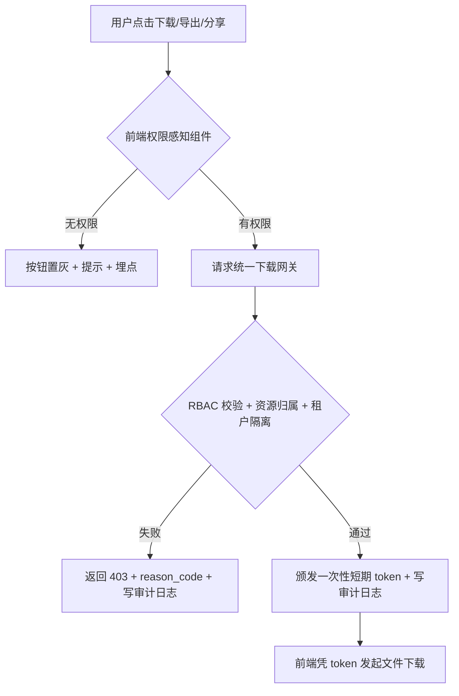

# Few-shots：solution-design 章节示例

> 以下示例均来自"平台级导出/下载/分享权限控制收口"真实案例。

---

## 摘要示例

> 本方案明确万智平台「导出/下载/分享」权限控制收口的功能范围与交付路径，属平台合规与安全基础设施建设，计划在 V2.3 迭代推进 P0 交付。由于本需求涉及 RBAC、统一下载网关（新建服务）、审计日志、以及 6 处前端模块改造，本文（Layer 1）定义业务范围与目标，详细功能拆入各模块 breakdown PRD。

---

## 4.1 问题陈述示例

> 当前万智平台存在多处"内容外带"入口：历史记录分享、会话文件下载、Agent 产物导出、知识库/问答库文件下载、高代码版本包下载。各入口的权限策略相互独立，缺乏统一口径，普通成员可不受限制地下载全平台内容，高价值内容（如 AI 生成的 PPT/Excel、知识库文件、高代码工程包）存在大规模外流风险。
>
> 部分下载入口（尤其是高代码文件）使用前端直链或对象存储直链下载，权限控制完全依赖前端判断，后端无强制兜底；只要获取到 URL，任何人均可绕过权限直接下载。
>
> 平台目前缺乏统一的下载行为审计机制，无法追溯"谁在何时下载了什么资源"，企业合规面临盲区，商业化分层能力（如 Max 版本限制下载）也因此无从建立。

---

## 4.3 成功指标示例

> - 所有指定入口无 `download`/`share` 权限的普通成员，相关按钮均置灰且无法触发下载/分享。
> - 高代码版本包通过直接 URL 访问返回 HTTP 403（后端强制拦截，不依赖前端）。
> - 下载 token 重放攻击返回 403（token 一次性有效）。
> - 每次下载/导出/分享操作（含被拒绝的）均产生完整审计日志，必须字段无缺失。
> - 管理员变更"普通成员"角色权限后，用户下次操作立即生效，无需重新登录。

---

## 4.4 方案价值示例

> 消除高价值内容外流风险：普通成员默认无法下载/分享任何内容，高价值产物（AI PPT、知识库文件、高代码工程包）不再有外流漏洞。
>
> 建立企业级审计能力：所有下载/导出/分享操作（含被拒绝）均可追溯，覆盖企业合规要求，为安全事件溯源提供基础。
>
> 为商业化分层提供能力基础：download/share 权限可按角色/套餐灵活配置，Max 版本差异化下载能力由此可落地。

---

## 5.2 用户故事示例

**Story 1**：作为普通成员，我希望能在无下载权限时看到清晰的按钮禁用状态和提示文案，以便我知道应联系管理员而不是面对一个无响应的按钮。

- AC：下载/导出按钮置灰，鼠标悬停或点击时弹出提示："无下载权限，请联系管理员"。
- AC：阻断事件记录埋点（含 reason_code 与来源页面）。

**Story 2**：作为组织管理员，我希望能在一个集中的配置页为"普通成员"角色开关下载和分享权限，以便我能在不修改个人用户的情况下统一管控内容外带策略。

- AC：角色权限配置页新增 download（含 export）和 share 权限开关。
- AC：关闭权限后，普通成员所有指定入口立即生效（无需重新登录）。
- AC：资源创建者不享有豁免权，策略与普通成员一致。

**Story 3**：作为租户管理员，我希望每次下载、导出和分享操作（包括被拒绝的）都有包含用户身份和资源详情的完整日志，以便我能进行合规审计和安全事件溯源。

- AC：每次操作（含被拒绝）均产生审计日志，包含：user_id、resource_type、resource_id、action、result、reason_code、timestamp、source_page、ip、request_id。
- AC：日志持久化存储；写入失败时不阻塞下载，但触发告警。

**Story 4**：作为系统，我希望所有文件下载请求都通过统一网关路由，以便直接访问 URL 的方式无法绕过权限控制。

- AC：无有效 token 的下载请求返回 HTTP 403。
- AC：Token 一次性有效，同一 token 第二次使用返回 403。
- AC：跨租户资源访问返回 403（租户隔离）。

---

## 6.1 架构概述示例

数据流说明：

1. 前端请求权限状态 → 权限服务（RBAC）返回 allowed/denied。
2. 用户发起下载 → 前端向统一下载网关请求 token（携带 resource_type、resource_id、action、context）。
3. 网关校验通过 → 颁发一次性短期 token + 写审计日志 → 前端凭 token 下载。
4. 网关校验失败 → 返回 403 + reason_code + 写审计日志。

---

## 7.1 功能模块清单示例

| 一级功能 | 二级功能 | 模块说明 | 优先级 |
| --- | --- | --- | --- |
| 权限控制 | RBAC 接入 | 为 download（含 export）和 share 动作新增权限项，接入现有 RBAC 体系；默认普通成员两项权限均关闭；资源创建者无豁免权 | P0 |
| 权限控制 | 权限配置页 | 角色权限配置页新增 download 和 share 开关，针对"普通成员"角色，变更实时生效 | P1 |
| 权限控制 | 前端权限感知组件 | 统一封装所有下载/导出/分享按钮，无权限时置灰并展示标准提示文案，统一埋点 | P1 |
| 统一下载网关 | 网关服务 | 新建后端服务，接替各模块分散的下载逻辑；负责 RBAC 校验、资源归属+租户隔离校验、一次性 token 颁发 | P0 |
| 审计日志 | 日志记录 | 所有下载/导出/分享操作（含被拒绝）写入审计日志；异步写入，持久化存储 | P0 |
| 各入口改造 | 历史记录 & 会话文件 | 分享入口接入 share 权限；会话文件下载接入 download 权限；预览与下载分离，预览不校验权限 | P0 |
| 各入口改造 | Agent 产物 | AI 写作/PPT/Excel/插件/技能的下载/导出入口接入 download 权限 | P0 |
| 各入口改造 | 知识库 & 问答库 | 文件下载入口接入 download 权限 | P0 |
| 各入口改造 | 高代码 | 版本包下载接入 download 权限；后端对无有效 token 的直接 URL 请求强制返回 403 | P0 |

---

## 八、分期计划示例

| 阶段 | 业务目标 | 功能模块 | 计划迭代 | 负责团队 | 对应 breakdown PRD |
| --- | --- | --- | --- | --- | --- |
| 第一期（核心收口） | 所有指定入口的下载/分享行为均受权限控制，后端强制拦截越权访问，全量审计可追溯 | RBAC 接入、统一下载网关、审计日志、各入口改造（P0 部分） | V2.3 | 后端/前端 | 待创建 - 权限模型 breakdown 待创建 - 统一下载网关 breakdown 待创建 - 审计日志服务 breakdown 待创建 - 各入口前端改造 breakdown |
| 第二期（体验完善） | 管理员可在配置页可视化管理角色权限，前端交互统一、提示明确 | 权限配置页、前端权限感知组件（P1 部分） | V2.3 | 前端 | 待创建 - 前端权限组件 breakdown |

---

## 九、风险与假设示例

### 9.1 技术风险

| 风险 | 影响 | 概率 | 对策 |
| --- | --- | --- | --- |
| RBAC 系统不支持新增 action 粒度权限 | 整体方案无法落地，需重新设计权限模型 | 低 | 立项前与权限团队确认 RBAC 扩展能力 |
| 统一下载网关引入额外延迟，影响下载体验 | 大文件下载响应变慢，用户体验下降 | 中 | 网关仅做鉴权+token 颁发，不代理数据流；P99 延迟目标 < 200ms |
| 前端各模块改造工作量超预期，影响迭代排期 | 6 处入口改造若串行推进，V2.3 无法全部完成 | 中 | 统一封装权限感知组件，各模块接入成本降至最低；优先保障 P0 入口 |
| 审计日志写入失败导致数据丢失 | 合规审计产生盲区 | 低 | 异步写入+告警机制；写入失败不阻塞下载，但触发监控报警 |

### 9.2 约束与假设

**技术约束：**

- 改造不影响现有文件生成机制，不影响运行中任务逻辑。
- 统一下载网关可用性 ≥ 99.9%（与现有文件服务 SLA 对齐）。
- 前端不得直接拼接对象存储 URL，所有下载统一走网关。

**系统假设：**

- 假设 RBAC 系统支持新增 `download`（含 export）和 `share` 动作权限。
- 假设各前端模块可以独立接入权限感知组件，不存在架构级阻碍。
- 假设审计日志存储系统支持持久化写入，写入失败可触发告警。
